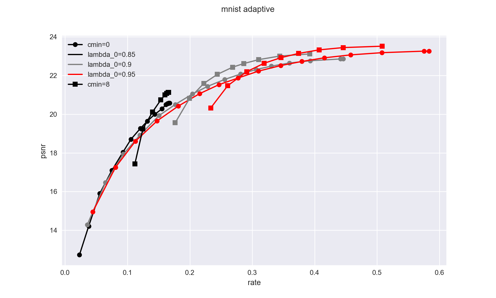

# One-Hot Max ($\Omega$) Quantization for Learned Image Compression With Fixed, Variable, or Adaptive Bitrate

[Jonas Löhdefink](https://www.tu-braunschweig.de/ifn/institut/team/sv/loehdefink), Jonas Sitzmann, [Andreas Bär](https://www.tu-braunschweig.de/ifn/institut/team/sv/baer), and [Tim Fingscheidt](https://www.tu-braunschweig.de/ifn/institut/team/sv/fingscheidt)

## Description

Within the field of image compression by deep neural networks we propose a *One-Hot Max (OHM, $\Omega$)* approach to learned quantization ([link to paper](?)). Instead of plain integer rounding, each data vector is encoded to a one-hot vector which in turn can be represented by a single integer.


This repository provides pytorch code for training our image compression models (integer rounding and $\Omega$ quantization) as well as pretrained models.

## Results for the mnist dataset
Influence of the $\lambda_rd$ parameter on the rate distortion curve (only ohm quantization)


Comparison of the rate distortion curves of the ohm and int quantation methods for different number of bottleneck channels


## Requirements

We reccomend using [anaconda](https://www.anaconda.com/) to install the python environment: `conda env create -f env.yaml`
The project uses pytorch 1.10.0 with [pytorch-lightning](https://www.pytorchlightning.ai/) and [einops](https://einops.rocks/). Entropy coding of quantized data is performed by [torchac](https://github.com/fab-jul/torchac).

## Inference
The `compress.py` script can be used to evaluate a trained model on a set of test images.
Note that models trained with the `--mnist` flag expect gray-scale images.
For adaptive bitrate models, the `--channel_fractions` parameter can be used to specify the fraction of bottleneck channels to be used.

The script expects the following parameters:
```
python compress.py \
  --image_path <...> \ # path to single image or directory of images (png and/or jpg)
  --checkpoint <...> \ # path to a pretrained model
  --output_dir <...> \ # optional target directory for inference results
  --channel_fractions <...> \ # optional list of quality levels for adaptive bitrate 
  --do_save \ # optional flag to save encoded and decoded images (default: only metrics)
  --do_plot \ # optional flag to plot rate_distortion curves
```


## Training

### Data preparation
When training the mnist models, no further steps are required since the dataset is downloaded automatically.

When training the openimages models, a parameter `--data_base_path` should be provided which points to the following directory structure:
```
data_base_path
├── openimages
│   ├── train
│   │   ├── <filename1>.jpg
│   │   ├── <filename2>.png
│   │   ├── ...
│   ├── validation
│   │   ├── ...
```


The `train.py` script can be used to train an image compression model. The script expects the following parameters:
```
python train.py \
 -n_epochs <...> \
 -batch_size <...> \
 -learning_rate <...> \
 -encoder_channels <...> \
 -bottleneck_channels <...> \ # one or two values
 -no_quant_symbols <...> \ # if --no_quant flag is not used
 --data_base_path <...> \ # (when not using mnist) path to directory containing the openimages dataset
 --mnist \ # optional flag for training on mnist instead of openimages
 -lambda_rd <...> \ # one or two values!
 -no_quant \ # flag for skipping quantization
 -integer_quant \ # integer rounding instead of ohm
 --description <...> \
 --output_dir <...>  # optional
```
E,g, a command line call to train a model on the mnist dataset with our appoach and adaptive bitrate could look like this:

```
python train.py \ 
  --mnist \
  -batch_size 512 \
  -n_epochs 1000 \
  -learning_rate 1e-3 \
  -lambda_rd 0.95 0.999 \
  -encoder_channels 8192 \
  -bottleneck_channels 0 32 \
  -no_quant_symbols 256 \
  --test_sets data/mnist_png/validation data/mnist_png/testing \
```

The scripts used for creating the checkpoints from [link]() can be found in the `slurm` directory.
These are designed to be run on a [slurm](https://slurm.schedmd.com/documentation.html) compute cluster.
Note: All scripts should be run from the root directory of the repository.
Also, when not using the mnist the


## Using this Work

This code is licensed under the MIT-License (see LICENSE.md). Feel free to use it within the boundaries of this license.

If you find our work useful or interesting, please consider citing [our paper](??):

```
...
```